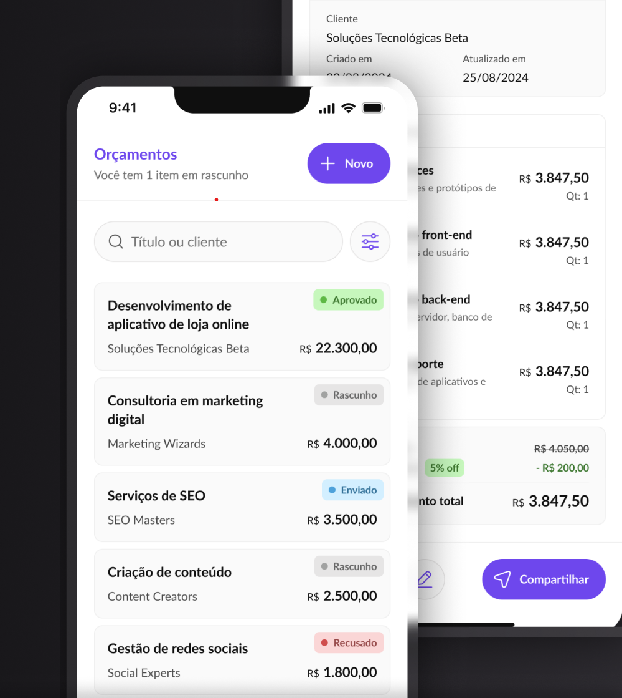

# Service Budget - Orçamentos de Serviços 📱💰

Um aplicativo mobile para gerenciamento de orçamentos de serviços, permitindo criar, visualizar e organizar propostas comerciais de forma prática e profissional.



## 📋 Sobre o Projeto

Service Budget é uma aplicação React Native desenvolvida para profissionais e empresas que precisam gerenciar orçamentos de serviços. O app permite criar orçamentos detalhados, incluir múltiplos serviços, aplicar descontos e acompanhar o status de cada proposta.

## ✨ Funcionalidades

- 📝 Criar novos orçamentos com múltiplos itens/serviços
- 👥 Cadastrar informações do cliente
- 💵 Calcular valores automáticos com desconto
- 🏷️ Gerenciar status dos orçamentos (Rascunho, Enviado, Aprovado, Recusado)
- 🔍 Buscar orçamentos por título ou cliente
- 🎯 Filtrar por status múltiplos
- 📊 Ordenar por data ou valor
- 📱 Interface moderna e responsiva
- 🎨 Design system consistente com Tailwind CSS

## 🛠️ Tecnologias Utilizadas

- [React Native](https://reactnative.dev/) - Framework mobile
- [Expo](https://expo.dev/) - Plataforma de desenvolvimento
- [TypeScript](https://www.typescriptlang.org/) - Tipagem estática
- [NativeWind](https://www.nativewind.dev/) - Tailwind CSS para React Native
- [React Navigation](https://reactnavigation.org/) - Navegação entre telas
- [AsyncStorage](https://react-native-async-storage.github.io/async-storage/) - Armazenamento local
- [Bottom Sheet](https://gorhom.github.io/react-native-bottom-sheet/) - Modais deslizantes
- [Expo Checkbox](https://docs.expo.dev/versions/latest/sdk/checkbox/) - Componentes de checkbox

## 🚀 Como Executar

### Pré-requisitos

- Node.js instalado
- Expo CLI instalado globalmente (`npm install -g expo-cli`)
- Expo Go no celular (iOS/Android)

### Passos

1. **Clone o repositório**

```bash
git clone https://github.com/seu-usuario/service-budget.git
cd service-budget
```

2. **Instale as dependências**

```bash
npm install
# ou
yarn
```

3. **Inicie o projeto**

```bash
npx expo start
# ou
npm start
```

4. **Execute no dispositivo**

- Use o app Expo Go para escanear o QR Code mostrado no terminal
- Ou pressione `a` para Android / `i` para iOS (necessário emulador configurado)

## 📱 Estrutura do Projeto

```
src/
├── assets/          # Ícones e imagens
├── components/      # Componentes reutilizáveis
├── context/         # Context API (Bottom Sheet)
├── hooks/           # Custom hooks (useStorage)
├── routes/          # Configuração de navegação
├── screens/         # Telas da aplicação
│   ├── Home/        # Listagem de orçamentos
│   ├── CreateBudget/  # Criação de orçamento
│   └── DetailsBudget/ # Detalhes do orçamento
├── shared/          # Utilitários e tipos
└── styles/          # Estilos globais
```

## 🎨 Design System

O projeto utiliza um design system baseado em:

- **Cores principais**: Purple (#6A46EB), Gray scale
- **Tipografia**: Lato (Regular, Bold)
- **Componentes**: Buttons, Inputs, Status badges, Cards
- **Ícones**: Mage Icons React

## 💾 Armazenamento

Os dados são armazenados localmente usando AsyncStorage através de uma camada de abstração (Storage Factory), facilitando futuras migrações para outras soluções de persistência.

## 📄 Licença

Este projeto está sob a licença MIT.

---

Desenvolvido com ♥ usando React Native e Expo